# webserver 博客项目

<!-- TOC -->

- [webserver 博客项目](#webserver-博客项目)
  - [nodejs介绍](#nodejs介绍)
    - [nodejs 和 js的区别](#nodejs-和-js的区别)
    - [commonjs模块化演示](#commonjs模块化演示)
    - [nodejs中Debugger方式](#nodejs中debugger方式)
    - [server开发和前端开发的区别](#server开发和前端开发的区别)
  - [项目介绍](#项目介绍)
    - [项目需求分析](#项目需求分析)
      - [博客项目介绍](#博客项目介绍)
    - [技术方案](#技术方案)
  - [开发博客项目之接口](#开发博客项目之接口)
    - [http概述](#http概述)
      - [从浏览器输入url会发生哪几个步骤(简单说下)](#从浏览器输入url会发生哪几个步骤简单说下)
      - [浏览器控制台实际演示介绍](#浏览器控制台实际演示介绍)
    - [nodejs处理http请求](#nodejs处理http请求)
      - [nodejs处理get请求](#nodejs处理get请求)
      - [nodejs处理post请求](#nodejs处理post请求)
      - [nodejs处理http请求的综合示例](#nodejs处理http请求的综合示例)
    - [搭建开发环境](#搭建开发环境)
      - [项目目录结构](#项目目录结构)
    - [初始化路由](#初始化路由)
      - [开发接口](#开发接口)
    - [开发路由(博客列表路由)](#开发路由博客列表路由)
    - [开发路由(博客详情路由)](#开发路由博客详情路由)
    - [开发路由(处理POSTDATA)](#开发路由处理postdata)
    - [开发路由(新建和更新博客路由)](#开发路由新建和更新博客路由)
    - [开发路由(删除博客路和登陆路由)](#开发路由删除博客路和登陆路由)
    - [总结](#总结)
  - [开发博客项目之数据存储](#开发博客项目之数据存储)
    - [MySql介绍](#mysql介绍)
    - [数据库操作](#数据库操作)
    - [nodejs操作mysql](#nodejs操作mysql)
    - [操作使用](#操作使用)
    - [nodejs链接mysql做成工具](#nodejs链接mysql做成工具)
    - [API对接mysql](#api对接mysql)
      - [博客列表](#博客列表)
      - [博客详情和新建](#博客详情和新建)
      - [博客更新和删除](#博客更新和删除)
      - [登陆](#登陆)
      - [总.结](#总结-1)
  - [博客项目之登陆 🙌](#博客项目之登陆-)
    - [start](#start)
    - [cookie介绍](#cookie介绍)
    - [cookie用于登陆验证](#cookie用于登陆验证)
      - [server端nodejs操作cookie](#server端nodejs操作cookie)
    - [cookie做限制](#cookie做限制)
    - [session介绍](#session介绍)
      - [上节只用cookie的话会有缺陷](#上节只用cookie的话会有缺陷)
      - [为blog-1项目添加session](#为blog-1项目添加session)
    - [session演示](#session演示)
      - [总..结](#总结-2)
    - [从session到redis](#从session到redis)
      - [session方案的问题](#session方案的问题)
      - [进程内存模型](#进程内存模型)
      - [内存问题](#内存问题)
      - [解决方案redis](#解决方案redis)
      - [为何session适合用redis？](#为何session适合用redis)
      - [为何网站数据不适合用redis？](#为何网站数据不适合用redis)
    - [redis介绍](#redis介绍)
      - [安装redis](#安装redis)
      - [用redis存储session](#用redis存储session)
    - [nodejs链接redis的demo](#nodejs链接redis的demo)
    - [nodejs链接redis的封装工具函数](#nodejs链接redis的封装工具函数)
    - [session存入redis](#session存入redis)
    - [完成server端登陆的代码](#完成server端登陆的代码)
    - [联调-介绍html页面](#联调-介绍html页面)
      - [开发前端网页](#开发前端网页)
    - [nginx配置](#nginx配置)
      - [nginx介绍](#nginx介绍)
      - [nginx反向代理](#nginx反向代理)
      - [nginx安装](#nginx安装)
      - [nginx演示](#nginx演示)
    - [联调演示与总结](#联调演示与总结)
      - [登陆总结](#登陆总结)
  - [博客项目之日志](#博客项目之日志)
    - [开始](#开始)
      - [目录](#目录)
    - [nodejs文件操作](#nodejs文件操作)
    - [stream介绍](#stream介绍)
      - [IO(输入输出)操作的性能瓶颈](#io输入输出操作的性能瓶颈)
      - [stream](#stream)
    - [stream演示](#stream演示)
    - [写日志](#写日志)
    - [拆分日志](#拆分日志)
      - [crontab](#crontab)
      - [为什么不用nodejs操纵](#为什么不用nodejs操纵)
      - [代码演示](#代码演示)
    - [分析日志介绍](#分析日志介绍)
    - [readline演示](#readline演示)
    - [总...结](#总结-3)
  - [博客项目之安全](#博客项目之安全)
    - [开始和sql注入](#开始和sql注入)
      - [安全](#安全)
      - [补充](#补充)
      - [sql注入](#sql注入)
    - [xss攻击](#xss攻击)
    - [密码加密和总结](#密码加密和总结)
      - [总结-](#总结-)
    - [统一总结](#统一总结)
  - [使用express重构博客项目](#使用express重构博客项目)
    - [开。始](#开始-1)
      - [目-录](#目-录)
    - [express安装](#express安装)
    - [介绍express的入口代码](#介绍express的入口代码)
      - [介绍app.js](#介绍appjs)
    - [演示express如何处理路由](#演示express如何处理路由)
    - [express中间件](#express中间件)
      - [中间件机制](#中间件机制)
    - [express介绍的总结](#express介绍的总结)
    - [express开发博客项目 - 初始化环境](#express开发博客项目---初始化环境)
      - [express开发接口](#express开发接口)
      - [初始化环境](#初始化环境)
    - [express处理session](#express处理session)
      - [登-陆](#登-陆)
    - [session连接redis](#session连接redis)
    - [登陆中间件](#登陆中间件)
    - [开发路由](#开发路由)
    - [介绍morgan](#介绍morgan)
      - [日志](#日志)
    - [使用morgan写日志](#使用morgan写日志)
      - [总-结](#总-结)
    - [中间件原理介绍](#中间件原理介绍)
      - [express中间件原理](#express中间件原理)
    - [中间件原理代码实现](#中间件原理代码实现)
    - [总--结](#总--结)
      - [下一步](#下一步)
  - [使用Koa2重构博客项目](#使用koa2重构博客项目)
    - [-开始](#-开始)
      - [使用koa2](#使用koa2)
      - [介绍async/await](#介绍asyncawait)
    - [介绍koa2](#介绍koa2)
      - [介绍appjs](#介绍appjs-1)
    - [介绍路由](#介绍路由)
    - [介绍中间件机制](#介绍中间件机制)
    - [实现session](#实现session)
      - [koa2开发接口](#koa2开发接口)
      - [实现登陆](#实现登陆)
    - [开发路由准备工作](#开发路由准备工作)
      - [代码开始](#代码开始)
    - [开发路由代码演示](#开发路由代码演示)
    - [开发路由联调](#开发路由联调)
    - [日-志](#日-志)
    - [koa2中间件原理分析](#koa2中间件原理分析)
    - [koa2中间件原理代码演示](#koa2中间件原理代码演示)
    - [-总结](#-总结)
      - [下一步问题](#下一步问题)
  - [上线与配置](#上线与配置)
    - [开始和PM2介绍](#开始和pm2介绍)
      - [PM2介绍](#pm2介绍)
    - [常用命令](#常用命令)
    - [进程守护](#进程守护)
    - [常用配置](#常用配置)
    - [多进程](#多进程)
    - [关于运维](#关于运维)
      - [-总结-](#-总结-)

<!-- /TOC -->
## nodejs介绍

### nodejs 和 js的区别

- ECMAScript
  - 定义了语法，写js和nodejs都必须遵守
  - 变量定义循环判断函数
  - 原型和原型链作用域闭包异步
  - 不能操作DOM，不能监听click事件，不能发送ajax请求
  - 不能处理http请求，不能操作文件
  - 即只有ECMAScript几乎做不了任何实际的项目，只是定义了语法
- javascript
  - 使用ECMAScript规范外加Web API(是W3c的标准)，(语法+api) 缺一不可
  - 两者结合，即可完成浏览器端的任何操作
- Nodejs
  - 使用ECMAScript语法规范，外加nodejs API ，缺一不可
  - 如处理http，处理文件等具体参考http://nodejs.cn/api/
  - 两者结合，即可完成server端的任何操作

### commonjs模块化演示

> 见commonjs-test

- 我们在nodejs中使用commonjs模块化的标准

### nodejs中Debugger方式

> 见debugger-test文件夹

- vscode的打断点方式为 点左侧七星瓢虫或F5
- package.json文件中main的值必须和主组件文件名字对应上，要不vscode的debugger会对应不上
- 当我们像app文件里的3000端口请求后，浏览器会先后发出2次请求，第一个请求是localhost的helloworld的主体内容，第二个请求是favicon.ico请求就是浏览器标签页左上角图标的请求----这两次请求都会经过http.createServer代码

### server开发和前端开发的区别

- 服务稳定性(一旦挂了那所有的client都访问不了了)
  - server端可能会遭受各种恶意攻击和误操作
  - 单个客户端可以意外挂掉，但是服务端不能
  - 课程后面会讲解使用PM2做进程守候(进程守候就是进程一旦挂掉了它会监测自动重启)
- 考虑内存和cpu(优化，扩展)---(cpu和内存不够用了，怎么去优化或扩展cpu和内存)
  - 客户端独占一个浏览器，内存和cpu都不是问题(就算出现内存泄漏也不是什么问题)
  - server端要承载很多请求，cpu和内存都是稀缺资源
  - 课程后面会讲解使用stream写日志(来优化cpu和内存)，使用redis存session(来扩展cpu和内存)
- 日志记录(没有日志我们程序的运行就像瞎子一样什么都不知道)
  - 前端也会参与写日志，但只是日志的发起方，不关心后续
  - server端要记录日志，存储日志，分析日志，前端不关心
  - 课程后面会讲解多种日志记录方式，以及通过nodejs如何分析日志
- 安全(server端是安全的最后保障)
  - server端要随时准备接收各种恶意攻击，前端则少很多
  - 如：越权操作，数据库攻击等
  - 课程后面会讲解登陆验证，预防xss攻击(前端后端都要预防)和sql注入
- 集群和服务拆分
  - 产品发展速度快，流量可能会迅速增加
  - 如何通过扩展机器和服务拆分来承载大流量？
  - 本课程虽然是单机器开发，但是从设计上支持服务拆分

## 项目介绍

### 项目需求分析

#### 博客项目介绍

- 定目标
  - 开发一个博客系统，具有博客的基本功能
  - 只开发server端，不关心前端
- 定需求
  - 首页，作者主页，博客详情页
  - 登陆页
  - 管理中心，新建页，编辑页
- 定ui设计
- 定技术方案
- 开发（开发只是占项目的一小部分）
- 联调
- 测试
- 上线
- 查看统计结果

### 技术方案

- 数据如何存储（作为后端每个博客文章应该存在哪里，前端不用考虑这些，前端直接把文章是存后端的）
  - 博客（作者的博客存储）
    - 存储博客（数据库设计表的形式）
  - 用户(作者存储)
    - 存储用户也是用数据库的表存
- 如何与前端对接，即接口设计
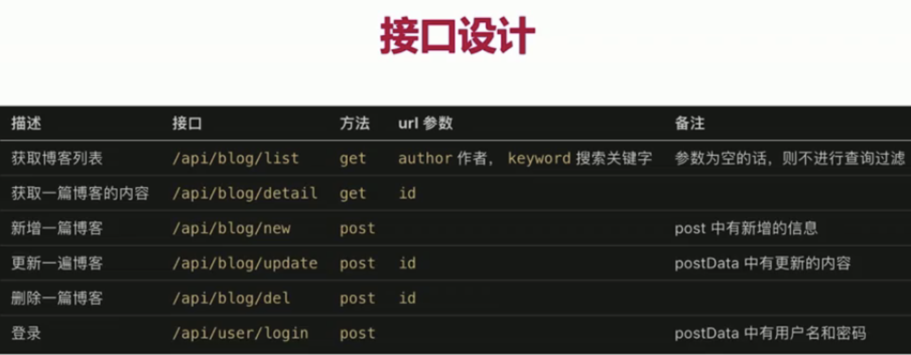
  - 里面的get是常用来获取一些数据，post(新增更新删除登陆)发送一些数据
- 关于登陆
  - 登陆是非常麻烦的，业界有统一的解决方案，一般不用再重新设计，沿用方案即可
  - 使用框架简单，原生node实现比较麻烦

## 开发博客项目之接口

- nodejs处理http请求
- 搭建开发环境
- 开发接口(暂不连结数据库暂不考虑登陆)

### http概述

#### 从浏览器输入url会发生哪几个步骤(简单说下)

- 客户端：DNS解析，建立TCP链接，发送http请求
- server端：接收到http请求，处理并返回
- 客户端接收到返回数据处理数据(渲染页面，执行js)

#### 浏览器控制台实际演示介绍

- 刷新百度页面，在network中会有百度的请求，在Headers-tab页General里能看到RemoteAddress(远端地址)是119.75.217.26:443可以知道443端口号是https协议的默认端口号(http的默认端口是80不用明写默认就是)---上面的DNS解析就是把baidu域名解析成这个RemoteAddress地址就是DNS解析
- DNS解析一般分两个步骤：
  1. 浏览器或操作系统本身是有缓存的，如果缓存过期了或第一次访问没有缓存，浏览器或操作系统都会去域名供应商那里通过域名去DNS服务器去换取IP地址
- 这样拿到域名IP后，客户端就开始和这个远端ip地址建立tcp链接，即三次握手四次挥手
  1. 客询问服务器你是否可以用
  2. 服务器告诉客你是可用的
  3. 客再次告诉服务器我知道了，我开始准备访问----三次握手后就开始发送http请求，发送的请求内容显示在RequestHeaders
  4. 发送完后server端处理请求返回头部内容显示在ResponseHeaders，正文内容显示在Response-tab页中是html字符串形式
  5. 加载返回的html文本，然后加载中还会对文本里面的图片css包js包又进行额外的http请求
  6. 最后四次挥手，断开链接‘

### nodejs处理http请求

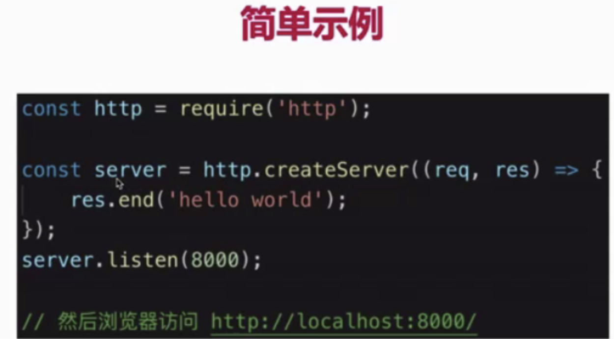

#### nodejs处理get请求

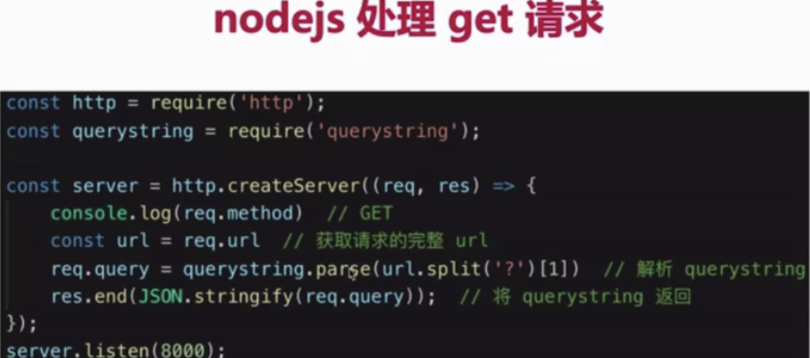
> 见http-test文件夹

#### nodejs处理post请求

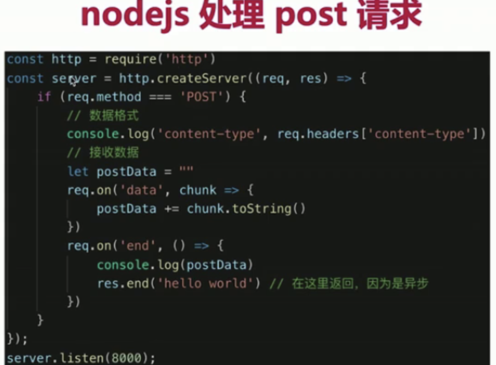

- post请求，即客户端要像服务端传递数据，如新建博客
- 浏览器无法直接模拟(浏览器可以直接模拟get)，需要手写js或者使用postman

#### nodejs处理http请求的综合示例

- res的end返回方法只能是返回字符串或二进制(不常用)，若是对象也得是序列化后的字符串形式

### 搭建开发环境

> 见blog-1文件夹（原生版本）

- 从0搭建，不用任何框架
- 使用nodemon检测文件变化，自动重启node
- 使用cross-env设置环境变量，兼容mac linux和windows

#### 项目目录结构

- 目录结构就是blog-1文件夹结构
- 入口文件是bin/www服务文件(专门提供http服务的一个文件)，主组件文件是appjs文件(该文件负责一些搭整体架子，处理一些公共数据，路由相关数据库控制层等都的抽出交给src去做)
- app主业务文件要与bin/www起服务文件分层逻辑处理，app主业务文件与server是没有关系的他是一些项目底层的业务代码，但wwwjs里是和server技术相关的
- src目录下如router文件夹各个文件是所有业务接口文件，最后都给app文件使用

### 初始化路由

- 上节课环境搭建好了，这节学怎么来开发路由

#### 开发接口

- 初始化路由：根据之前技术方案设计，作出路由
  - 可以知道api接口分两个类型api/blog类型和api/user登陆相关的类型就需要在src/router文件夹中建两个模块文件(blog和user模块)
  - 做路由///详见appjs文件src/router/blog 和src/router/userjs等文件
- 返回假数据：将路由和数据处理分离，以符合设计原则

### 开发路由(博客列表路由)

- 要先建个数据模型层--(只关心数据原型定义) **新建model/resModel.js文件**---也给对应的路由文件用-因为在appjs中res.end返回的时候需要返回一个格式比较规范的数据模型
- 我们还要建个src/controller文件夹--主要是控制层数据的处理业务逻辑处理(只关心数据的处理)，并且文件夹下建blog.js文件和user.js文件---给对应的路由文件用如router/blog.js引入

### 开发路由(博客详情路由)

- 因为要处理post请求，由于他的数据流特性 是异步的，我们得用promise的方式啦解决，我们先简单学习下**promise-test文件夹**这个promise练习文件夹中通过一个小需求来学习promsie

### 开发路由(处理POSTDATA)

- 因为他是异步的，单独在appjs文件中抽出getPostData函数来处理这个异步post data数据流

### 开发路由(新建和更新博客路由)

- 每写好一个路由，都得从router和controller两方面链接写好

### 开发路由(删除博客路和登陆路由)

- 每写好一个路由，都得从router和controller两方面链接写好
- 然后开始写登陆路由 **见router/user.js文件**（然后对应在controller下建user.js文件）

### 总结

- 掌握nodejs处理http请求的常用技能，postman的使用
- nodejs开发博客项目的接口(暂时未链接数据库，未使用登陆)
- 理解为何要将router和controller分开
  - router是只管路由相关的，来了什么路由我就对应分配什么数据(数据的来源交给controller专门机构去处理)，我同时还要保证分配数据的格式规范是什么样的，具体内容交给专门机构(errNo为0正确，errNo为-1错误，datamessage等)
  - controller只管处理数据，来自哪个路由的我不管，哪个路由调用我我就听谁的，处理好数据

## 开发博客项目之数据存储

### MySql介绍

- 为何使用mysql而不是mogondb？
  - mysql是企业内最常用的存储工具，一般都有专人运维
  - mysql也是社区内最常用的存储工具，有问题随时可查
  - 另mysql本身是一个复杂的数据库软件，本课只讲基本使用

- mysql介绍
  - web server中最流行的关系型数据库
  - 官网可免费下载，用于学习
  - 轻量级，易学易用
- 直接官网下载
- mysql安装
  - 执行安装
  - 过程中需要输入root用户名的密码，要切记这个密码
- 安装mysql workbench软件
  - 操作mysql的客户端，可视化操作
  - 掌握它的下载安装基本使用自己网上找教程

### 数据库操作

- 建库
  - 创建myblog数据库
  - 执行show databases 查询
- 建表
  - 建表：初始化表时，必须建立表结构及完整的column，否则报语法错误，看不见column就全屏放大下软件即可
  - 现在只需要建两张表，blog表和user表，先只会建表结构不会建内容
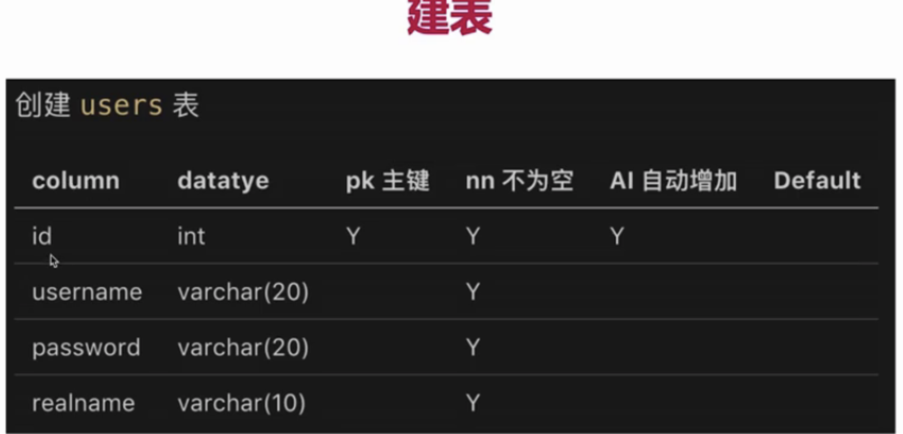
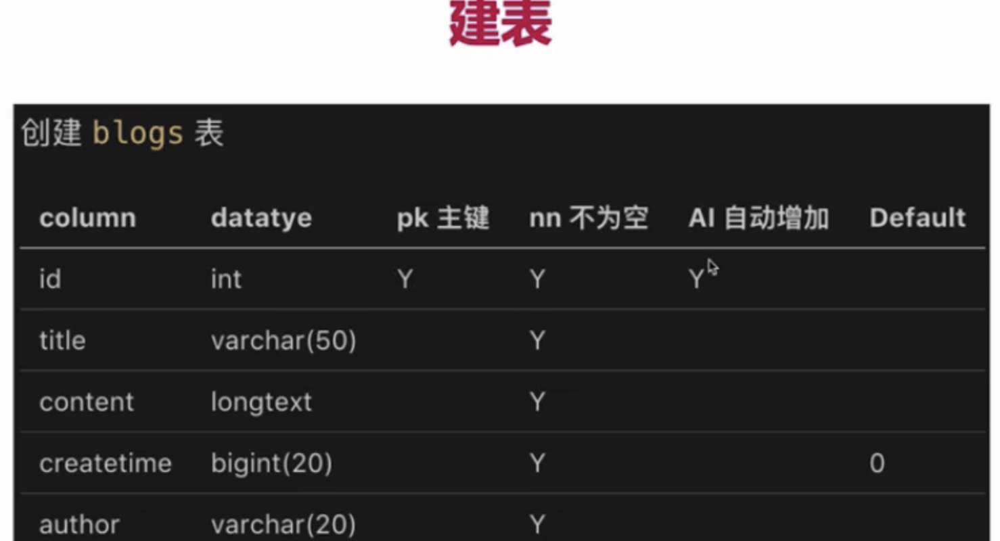
  - 上图的第一列是表格的所有列头
- 表操作(是nodejs连数据库的基础)
  - 增删改查
  - 使用sql语句(易学)
- 建表时常用数据类型(int bigint varchar longtext)
软删除：不是真正的操作delete语句去删除，就是通过update语句将其state状态设为0什么的，查询的时候查可见的数据state为1就是软删除

软删除的好处可以恢复改下状态即可了

### nodejs操作mysql

- 示例：用demo使用不考虑使用
- 封装：将其封装为系统可用的工具
  - 分为线上配置线上的数据库肯定和线下的数据库是不一样的
  - 和线下配置
- 使用：让API直接操作数据库不再使用假数据

### 操作使用

> 具体见mysql-test代码文件夹

- 先npm i mysql三方模块
- oo

### nodejs链接mysql做成工具

- mysqlnode操作demo上节讲了怎么使用了，这回我们回到blog-1中准备在项目中使用
- 在项目中也先先npm i mysql三方模块
- 然后在项目创建src/conf存放配置相关的文件夹/db.js文件
- 然后在项目下建个src/db文件夹(db文件夹主要是数据库操作相关的一些文件)
  - 注意要学会利用promise解决外界拿到函数2参回调结果值(db/mysql.js文件)
  - 这个文件中保持数据库连接不用写con.end()断开

### API对接mysql

- 上面的工具写好之后，就可以继续写接口处理的逻辑了替换掉之前的假数据
- 见controller文件夹和router文件夹sql部分内容和需要换成promise接收result，和appjs文件中

#### 博客列表

- 看相关文件就好

#### 博客详情和新建

- 看相关文件就好

#### 博客更新和删除

- 看相关文件就好

#### 登陆

- 先见controller/userjs文件
- 再见router/userjs文件
- 最后再见app主组件文件

#### 总.结

- nodejs链接mysql，如何执行sql语句
- 根据NODE_ENV区分配置
- 封装exec函数，API使用exec操作数据库

## 博客项目之登陆 🙌

### start

- 登陆
  - 核心：登陆校验 & 登陆信息存储
    - 如页面中的访问功能操作等必须得先校验登陆成功后才能正常工作否则跳转登陆
    - 如要存储用户名登陆信息，以后进行操作的时候就能知道当前登陆用户是谁了
  - 为何只讲登陆不讲注册？
    - 注册是没有什么难的，登陆是有点难的
- 本章重点
  - cookie和session
    - cookie是实现登陆的必要的基础
    - session是目前实现登陆的解决方案
  - 然后session写入redis(mysql是硬盘数据库，redis是内存数据库--本节用它来存储session)
  - 开发登陆功能 和前端联调(用到nginx反向代理)

### cookie介绍

- 什么是cookie
  - 存储在浏览器的一段字符串(5kb)
  - 跨域不共享
  - 格式如k1=v1;k2=v2;k3=v3; 因此手动分号的方式来存储伪结构化的数据
  - 每次发送http请求，会将请求域的cookie一起发送给server
  - server端可以修改cookie并返回给浏览器
  - 浏览器中也可以通过js修改cookie(有限制)
    - 因为server端修改完之后返给浏览器，然后通过某一种方式server端把cookie锁死，不让js修改或获取--就是有限制
- js操作cookie，浏览器中查看cookie
- server端操作cookie，实现登陆验证

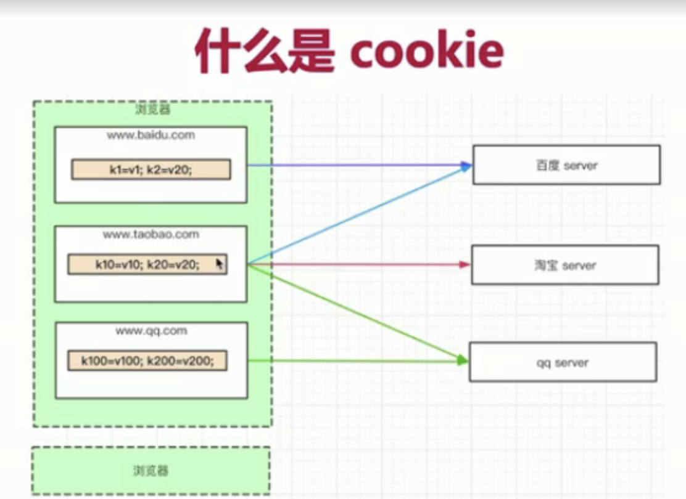

- 根据图可知，每次发送请求的时候，都会把目标请求域的cookie给带过去，请求的是哪个域就把哪个域的cookie带过去(如淘宝网中访问百度时，浏览器会自动把百度域下的cookie带过去)

### cookie用于登陆验证

#### server端nodejs操作cookie

> 详见blog-1的appjs文件（解析 cookie）部分看怎么操作cookie的

- 查看cookie
- 修改cookie
  - 登陆用的cookie不能在前端改，只能要求在后端改，禁止用户在浏览器控制台直接就写js改掉非常不安全

```javascript
// 后端操作唯一方法 操作cookie
res.setHeader('Set-Cookie', `username=${data.username}; path=/`)
```

- 实现登陆验证
  - 专门访问router/user中**登录验证的测试**部分的接口是单独用来做登陆验证的接口，只是测试正式项目里会删掉

### cookie做限制

- 做限制，让cookie修改只能在服务端改不让在浏览器端改

```javascript
// 操作cookie   -- 其中加httpOnly就可以禁止用户在浏览器端修改cookie，只能由后端改
// res.setHeader('Set-Cookie', `username=${data.username}; path=/; httpOnly`)
```

- 见appjs文件，给cookie设置个expires过期时间，要不给cookie设过期时间的话，expires默认会显示1969年就永远不过期，除非关掉浏览器

### session介绍

#### 上节只用cookie的话会有缺陷

- 上一节的问题：若都放cookie的话，外面client端会暴漏username等个人信息，很危险
- 用cookie也是必要的，所以如何解决：cookie中存储userid，由server端存对应的username等个人信息
  - server端是很安全的不容易被拿到，不会被暴漏出去，外界用户拿到userid也是无意义的
  - 而且存储量可以很大不只是5k
  - 这个server端存的方式就是session
- 解决方案：session，即server端存储用户信息
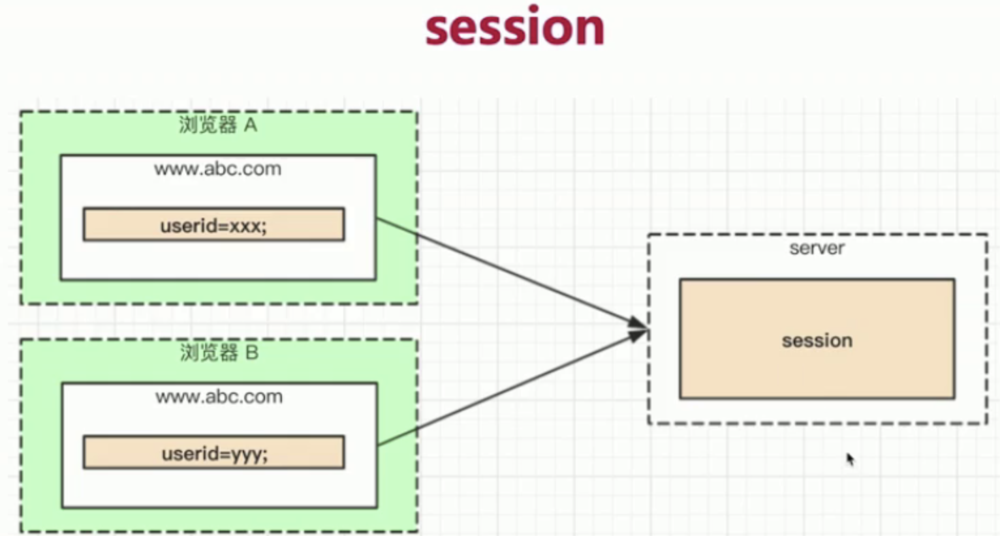

#### 为blog-1项目添加session

- 先在appjs文件中写session，需要定义个SESSION_DATA全局变量，然后在下方解析cookie后再新增解析session
- 然后在router/user文件中登陆后，存cookie改成存入session

### session演示

#### 总..结

- 知道session解决的问题
- 如何实现session

### 从session到redis

#### session方案的问题

- 目前session直接是js变量，放在nodejs进程内存中的
  - 现在这个sessionData就是代码中的一个全局变量，代码中变量就是程序运行起来的一个进程中的内存块
- 第一：进程内存有限，访问量过大，内存暴增怎么办？
- 第二：正式线上运行是多进程，进程之间内存无法共享

#### 进程内存模型

- 操作系统会给每个启动的进程分配下面这样的一个内存块(0x1000是起始地址，0x8000是结束地址)，heap里存引用类型变量(session就存这里)，基础类型变量就存stack里，万一访问量过大内存就会超出内存块分配容量就不好，


#### 内存问题

- 操作系统会限制一个进程的最大可用内存。nodejs在32位系统中只有1.6g内存限制，在64位系统中不会超过3g内存限制，所有可用内存是有限的
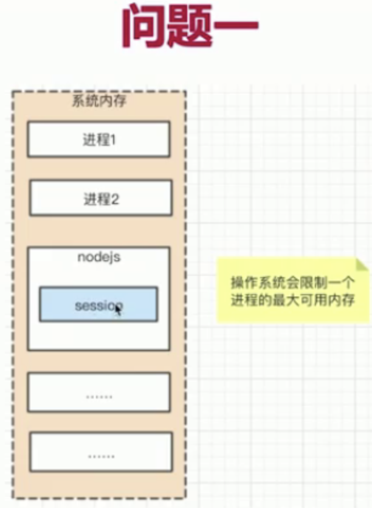

- 正式上线的时候，nodejs都是分多个进程来跑的
  - 因为操作系统对一个进程的内存分配是有限的，服务器内存都很大，分成多个进程来跑的话，就能占的内存更多一些，一个node进程最多可用1.6g，分成2进程就能共占取到3.2g内存)
  - 现在处理器都是多核的，多个核可以并行处理多个任务，多核处理器可以同时处理多个进程任务执行，所以不管是内存使用量上还是cpu的使用量上都期望是符合服务器当前的硬件标准去启动，多个进程再升级扩展就是多个机器多个机房多个集群
- 若每个进程都有session的话，进程之前内存是不能共享的，就会出现pm2管理负载均衡时会每次访问都命中最空闲的进程，就有可能上次刚刚登陆，再去访问命中其他进程了让你重新登陆，不好
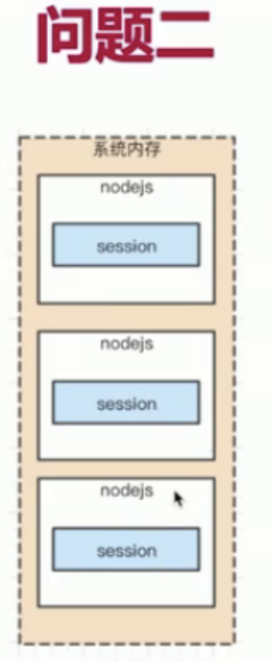

#### 解决方案redis

- web server 最常用的缓存数据库，数据存放在内存中
  - (内存有什么特点: 优点：读写特别快，缺点：内存比较昂贵比硬盘贵多了，存储空间小一些，内存一断电就丢失一关机就没了)
- 相比于mysql(硬盘存储的)，访问速度快(内存和硬盘不是一个数量级的)--是硬件决定的不管再怎么优化都干不过内存上读取
  - redis和mysql都是存储数据的工具，前者内存数据库后者硬盘数据库都有各自的适用场景
- 但是成本更高，可存储的数据量更小(内存的硬伤)
- 所以一个系统中redis和mysql根据特点配合一起使用是个比较好的方案
  - 如博客的创建文章编辑啥的在server端用mysql，关于登陆的信息放在redis是比较好的
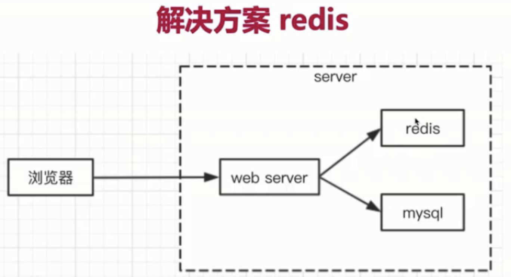

- 将web server 和 redis拆分为两个单独的服务(使用redis就可以完全解决之前session内存不能共享的问题)
- 双方都是独立的，都是可扩展的(例如都扩展成集群)
- 包括mysql，也是一个单独的服务，也可扩展

#### 为何session适合用redis？

- session访问频繁，对性能要求极高
- session可不考虑断电丢失数据的问题(内存的硬伤)
  - 断电丢了没关系，重新登陆下就行呗
- session数据量不会太大(相比于mysql中存储的数据)
- 基于上面三点就适合用redis不用mysql

#### 为何网站数据不适合用redis？

- 操作频率不是太高(相比于session操作)
- 断电不能丢失，必须保留
- 数据量太大，内存成本太高

### redis介绍

#### 安装redis

- windows http://www.runoob.com/redis/redis-install.html
- Mac 使用brew install redis
  - 先brew install redis
  - 然后执行redis-server 服务就起来了
  - 再执行redis-cli  客户端就启动了会出现服务启动的域名和端口号，
  - 然后就可以执行命令如：set myname jinyan，值的形式必须是字符串，对象类型的话要JSON一下才行
  - get myname 就能获取到刚才的数据
  - 还有命令如：keys * 就能列出当前已存储的所有的key
  - del myname 就能删除该数据
- 我们就可以这些命令存储session了

#### 用redis存储session

- nodejs链接redis的demo
- 封装成工具函数，可供API使用

### nodejs链接redis的demo

- 先在终端启动redis server
- 然后进入项目目录 **新建具体见redis-test文件夹/indexjs文件看**
  - 链接之前需要安装下`npm i redis --save`这个包

### nodejs链接redis的封装工具函数

- 然后进入blog-1项目中去准备接入redis，在项目中封装工具函数
- 也要先在项目中安装`npm i redis --save`
- 接下来见blog-1项目文件夹开始
- 先从src/conf/db.js文件开始 ，新建个REDIS_CONF变量，也和MYSQL_CONF一样，分别dev和pro做2个配置，要保持host和redix客户端的redis一致
- 然后新建src/db/redis文件---作为链接redis的封装工具函数

### session存入redis

- 略

### 完成server端登陆的代码

- 原router/userjs下的login-test登陆验证逻辑可以注释了，我们将登陆验证放到router/blogjs中每个路由操作都加上登陆验证，不通过就直接跳转登陆，
- 具体见router/blog下的loginCheck登陆验证函数的增加
- 最后见router/userjs文件，将登陆的方式改成POST方式

### 联调-介绍html页面

- 登陆写完了redis接完了，就可以考虑联调了，登陆的话就依赖于cookie，postman没法用cookie，就只能实际浏览器客户端联调了
- 登陆功能依赖cookie，必须用浏览器联调
- cookie跨域不共享的，前端和server端必须同域
  - server端起的端口是8000端口，前端肯定不能起8000端口，要不然会冲突，但是server端口和前端端口不一样就跨域了，cookie还不能跨域共享，这个该怎么解决呢？？？
  - 需要用到nignx做代理，让前后端端同域，能联调起来

#### 开发前端网页

- 前端网页文件见html-test文件夹
- 看写好的静态网页的效果，前端也得起个服务让他们跑起来
  - 现在html-test项目下 `npm i http-server -g`, 安装个http服务模块
  - 安装完后在项目下执行：`http -server -p 8001` 设个端口起个服务，访问出来的地址(localhost:8001/index.html)，就能看到静态html页面了
  - 怎么让前端的8001端口访问到server端的8000服务不受跨域限制，下节我们介绍用nginx

### nginx配置

#### nginx介绍

- 高性能的web服务器，开源免费
- 一般用于做静态服务(如cdn的存管静态资源的功能,只要不需要服务器解析的都可放到cdn上面)，负载均衡(本课用不到)
- 还有反向代理(本课用到)

#### nginx反向代理

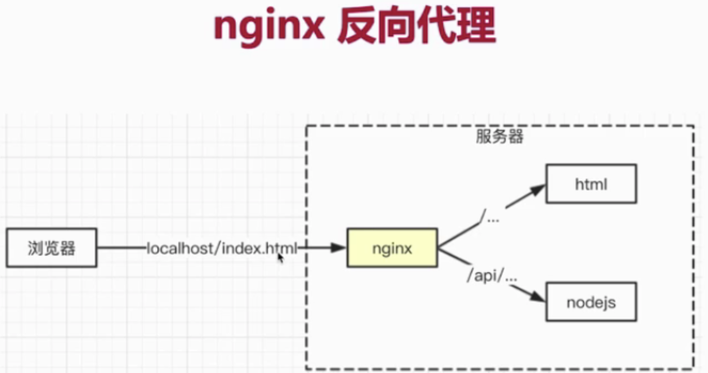

- 根据图可知，html那个端口是8001，nodejs是8000端口，我们在浏览器端indexhtml页面中先访问的是8080端口，(因为nginx监听的是8080)经过nginx处理判断，若是/后直接接的是文件地址名根目录的形式，则直接代理到html的8001服务中，若访问的接口/后是api开头的，则把它代理到nodejs的服务上并且返回结果
- 为什么叫反向代理呢？因为他是对客户端不可见的一个代理。和它相反的是正向代理，如公司的内网，我们在家里访问不了，就在自己的本机上装一个vpn代理工具，才能去访问，这属于一个正向代理即客户端能控制的代理，server端全部涵盖了客户端控制不了，对客户端来说他是一个黑盒。
- 服务端请求客户端的方向叫正向代理，客户端请求服务端的方向(如请求接口)叫反向代理

#### nginx安装

- Windows：http://nginx.org/en/download.html
- Mac: brew install nginx
- 安装完后，需要改下nginx配置文件
  - Windows: C:\nginx\conf\nginx.conf
  - Mac: /usr/local/etc/nginx/nginx.conf
- 保存完配置文件后需要执行的nginx命令(下面是mac命令，window命令不太一样)
  - 测试配置文件格式是否正确`nginx -t`
  - 启动`nginx`；重启`nginx -s reload`
  - 停止`nginx -s stop`

#### nginx演示

- 终端打开vim编辑器 `sudo vi /usr/local/etc/nginx/nginx.conf` 然后输入密码 进行终端编辑该配置文件
- 我们通过vim操作一下再保存重新启动下即可(window用户可以通过记事本管理员权限打开)

```javascript
// #user下一行：添加
worker_processes 2; // 指定工作进程使用cpu核数量：2 ；指定cpu几盒启动几个进程 我们机器是2核就写个2，若不写就默认启动1个进程性能就会差一些，

// 然后在server对象中
listen 8080 // 80改成8080端口

// 将以前的location配置对象注视掉，增加我们自定义的2个location对象
location / {
  proxy_pass http:\/\/localhost:8001; // 遇到斜线/开头的话就代理到这个地址下，/开头就是代理到静态文件资源
}
location /api/ {
  proxy_pass http:\/\/localhost:8000; // 遇到斜线/开头的话就代理到这个地址下，/开头就是代理到nodeserver端服务，供接口
  proxy_set_header Host $host;
}
```

- 写完之后 :wq 保存一下
- 保存后 `nginx -t` 来测试一下，说测试成功
- 然后直接`nginx` 命令来启动nginx，没有报错就说明启动成功了
- 然后浏览器访问localhost:8080/index.html就静态资源都成功了，api接口也能解决跨域，达到前后端同域联调

### 联调演示与总结

- 打开看html-test文件夹 看联调要注意的点

#### 登陆总结

- cookie是什么 session是什么 如何实现登陆
- redis在这里扮演什么角色 有什么核心价值
- nginx反向代理配置 联调过程中的作用

## 博客项目之日志

### 开始

- 系统没有日志，就等于人没有眼睛 ---- 抓瞎
- 第一，访问日志 access log (server端最重要的日志)
  - 即每次http请求都要记录请求情况
- 第二，自定义日志(包括自定义事件，错误记录等)

#### 目录

- 日志要放在文件中 就必须掌握nodejs文件操作 --要节省使用cpu节省使用内存 需要用到nodejs stream进行文件操作
- 日志功能开发和使用
- 日志文件拆分(我们总不能上线后一直写在一个文件吧那文件可太大了)，日志内容分析(如怎么去分析我们访问了一天的用户量里面chrome占比是多少ios占比是多少)
- 为何不存储到mysql中为何不存储到redis中
  - 首先日志文件非常非常大流量比较大的话一天的日志文件要好几个g容量呢，用redis成本就非常高，而且日志对性能要求不是特别高可以是异步记录日志，写文件都是个异步的操作，
  - mysql必须是满足表结构才行，多个表联动查询的一个使用场景，如果没有查表的一些复杂要求(where 排序)的话，就没必要用mysql，而且日志经常是多个服务器来拷贝用来存储分析的，显然是文件类型更加通用，尽管mysql比文件系统的性能快，文件操作是最慢的

### nodejs文件操作

- 新建file-test文件夹 先见test1.js文件
- 基本文件操作都是异步的

### stream介绍

#### IO(输入输出)操作的性能瓶颈

- IO包括“网络IO”和“文件IO”
- 相比于cpu计算和内存读写，IO的突出特点就是：“慢”
- 如何在有限的硬件资源下提高IO的操作效率？
- 我们借用stream方案解决 让他不至于那么慢，肯定是没有内存读写快相差好几个量级的

#### stream

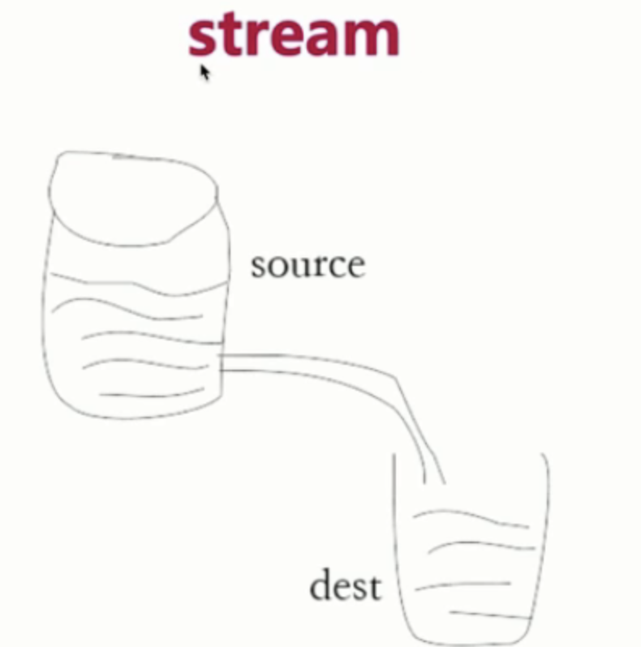

```javascript
// 标准输入输出，pipe就是管道的意思(符合水流管道的模型图)
// process.stdin 获取数据(就是第一个水桶)，直接通过管道传递给process.stdout(就是第二个水桶)
// 这样就会一边往第一个水桶里输入，同时一边也流向第二个水桶
process.stdin.pipe(process.stdout)
// process.stdin就是当前node进程中呈现在终端命令窗口中的用户输入的命令内容
// process.stdin就是当前node进程中呈现在终端命令窗口中的自定义设置用户敲回车后返回在终端显示的内容
```

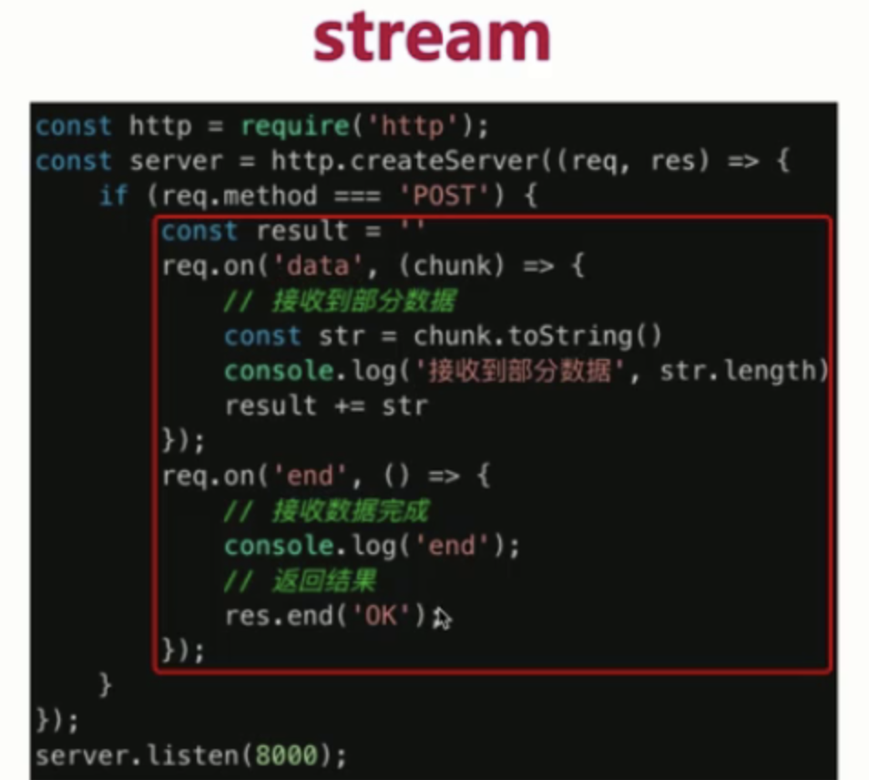
上图也是为了解决网络IO才这样做的data监听数据 拼接result方式的，提高执行效率

- 场景：通过post传数据上去，传完之后我们立马让他返回传了什么同时就返回什么，下面图中方式即可不用res.end方法了，说明了req res默认都具有stream的特性，可以让网络io请求变的那么顺畅
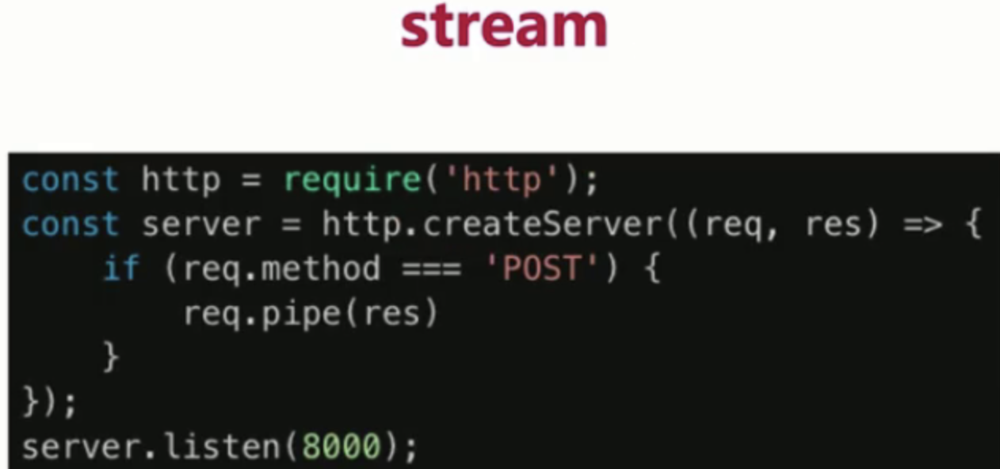

### stream演示

- 新建stream-test文件夹，具体见文件夹演示
- 通过stream的方式进行文件操作，具体见文件夹/test1.js方法
  - 拷贝文件---文件IO
  - 网络请求读取文件--网络IO
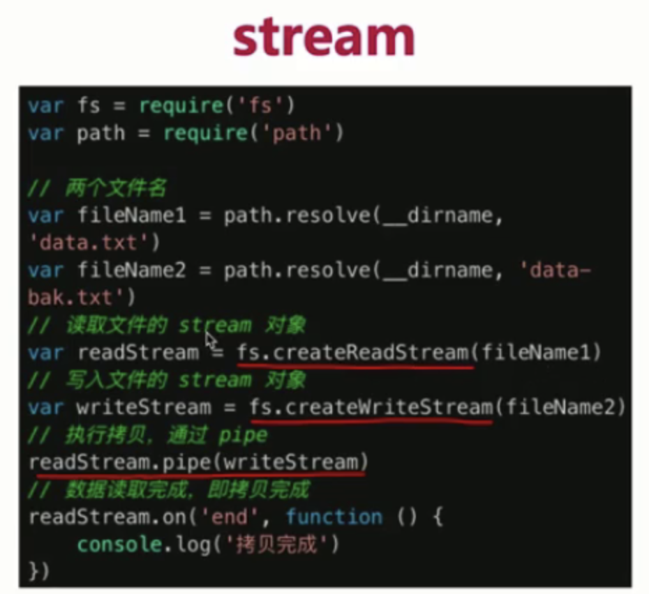

### 写日志

- 新建blog-1/logs文件夹日志目录，接着下面创建3个文件访问日志文件错误日志文件事件日志文件
- 然后在项目建src/utils文件夹下建log.js公共文件方法，具体见它
- 写好公共方法后，然后在appjs里引入用它，

### 拆分日志

- 日志内容会慢慢积累，放在一个文件中不好处理
- 按时间划分日志，如2019-02-10.access.log
- 实现方式：linux的crontab命令，即定时任务
- 服务拆分是在服务端做的，window下方式就先不讲

#### crontab

- 设置定时任务，格式：***** command
  - 共5个星，第一个星代表分钟，如果写成*就是忽略的意思，若写成1**** A命令：代表每1分钟执行A命令
  - 第二个星是小时，*1***就是每天的第一个小时执行该命令
  - 第三个星是日期每个月的多少号
  - 第4个星是月份每年的多少月执行
  - 第5个星是星期，每星期的星期几去执行该命令(0-6)
  - command是一段shell脚本
- 将access.log拷贝并重命名为2019-02-10.access.log
- 清空access.log文件，继续积累日志

#### 为什么不用nodejs操纵

- 用nodejs操作拷贝重命名等拆分也可以，nodejs毕竟只是操作系统上面的一个进程，到了时间后你要启动进程执行操作，若用shell脚本的话，直接是通过操作系统来操作，shell脚本的比nodejs执行效率高多了

#### 代码演示

- 新建项目下utils/copy.sh脚本文件
- 然后写完后先在终端`sh copy.sh`执行shell脚本测试一下

- 然后在blog-1项目下执行终端命令：定时任务命令`crontab -e`后就会打开vim编辑器，自己在终端进行编辑即可
  - 定时任务命令`crontab -l`就会列出当前所有定时任务命令
- 编辑中输入`* 0 * * * sh /Users/jinyan/Desktop/blog-webserver/blog-1/src/utils/copy.sh`
- 就会在每天凌晨过后执行copy脚本

### 分析日志介绍

- 如针对access.log日志，分析chrome的占比
- 日志是按行存储的，一行就是一条日志，所以我们去按行分析
- 按行分析可以借助使用nodejs的readline(基于stream，效率高)
  - stream是一点点读取但不一定是一行行所以readline封装了下可以实现一行行读取，readline就是逐行读取

### readline演示

- 新建utils/readline.js文件

### 总...结

- 日志对server端重要性哦
- IO性能瓶颈，使用stream提高性能，nodejs中如何操作
- 使用crontab拆分日志，使用readline分析日志

## 博客项目之安全

### 开始和sql注入

#### 安全

- sql注入：窃取数据库内容 这是前端同学需要关心的
- xss攻击：窃取前端的cookie内容，前端后端都要做防护
- 密码加密：保障用户信息安全(重要!🌿)
  - 前端同学涉及不到，万一数据库被窃取了，最不应该被看到的就是用户信息的密码了，所要要密码加密存到数据库里，黑客拿到加密后的密码你也解不出来

#### 补充

- server端攻击方式非常多，预防手段也非常多
- 本课只讲解常见的能通过web server(nodejs)层面预防的
- 有些攻击需要硬件和服务来支持(需要OP(服务器运维人员)支持如防火墙 ip屏蔽等)，如DDOS

#### sql注入

- 最原始，最简单的攻击，从有了web2.0就有了sql注入攻击
- 攻击方式：输入一个sql片段，最终拼接成一段攻击代码
- 预防措施：使用mysql的escape函数处理输入内容即可
  - 它可能在登陆时的用户名输入框里输入sql片段，然后后端用这个输入的用户名去查询数据库时就会把这个含sql片段的用户名给带进去，就会误执行非法的sql语句，这时候可以用mysql提供的escape函数给其进行转义处理，这样就不会被识别成代码了
  - 可见controller/userjs文件内处理

### xss攻击

- 前端同学最熟悉的攻击方式，但server端更应该掌握
- 攻击方式：在页面中展示内容中掺杂js代码，以获取网页信息
- 预防措施：转化生成js的特殊字符
  - 有现成的工具包`npm i xss --save`
  - 然后在controller/blogjs文件中newBlog函数中对输入的titlecontent等内容进行xss包的处理
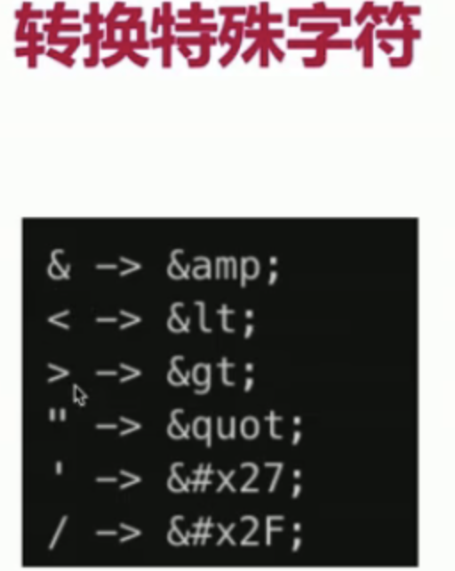

### 密码加密和总结

- 万一数据库被用户攻破，最不应该泄漏的就是用户信息
- 攻击方式：获取用户名和密码，再去尝试登陆其他系统
- 预防措施：将密码加密。即便拿到密码也不知道明文

> 具体见blog-1/utils/cryp.js文件
> 然后见项目下controller/user.js中修改下登陆，引用genPassword加密方法

#### 总结-

- 如何预防sql注入
- 如何预防xss攻击
- 如何加密密码

### 统一总结

- 总结下不使用框架的nodejs原生开发
  - 五个功能模块
    - 处理http接口
    - 链接数据库
    - 实现登陆
    - 安全
    - 日志
    - 上线(线上环境的知识点 最后一起讲)
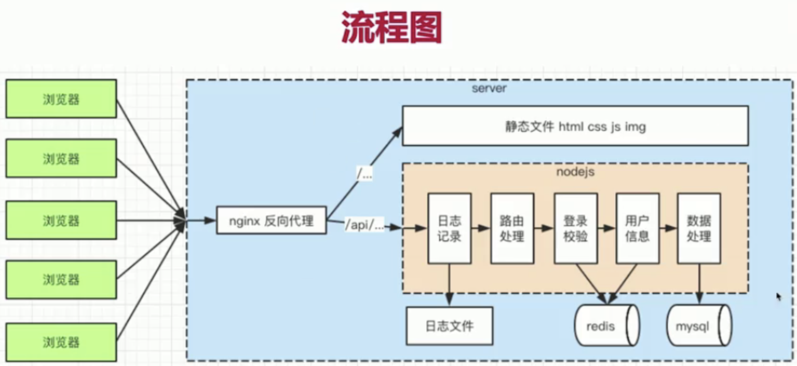

- server和前端5个区别
  - 服务稳定性(最后讲)
  - 内存CPU(优化 扩展)
  - 日志记录
  - 安全(包括登陆验证)
  - 集群和服务拆分(设计思想已支持)

- 下一步
  - 该blog-1项目 不使用框架开发 从0开始 关注底层api
  - 很琐碎很复杂没有标准可依 很容易将代码写乱
  - 本blog-1项目只适合学习 但不适合应用 接下来开始express和koa2

## 使用express重构博客项目

> 本项目见blog-express项目文件夹

### 开。始

- express是nodejs最常用的web server框架
- 什么是框架
  - 封装基本的api工具让开发者更加关注一些业务代码的开发
  - 框架有一定的流程和标准，按这个标准我们可以去开发更多的工具和插件
- 不要以为express过时了

#### 目-录

- express下载 安装和使用 express中间件机制
- 开发接口 链接数据库 实现登陆 日志记录
- 分析express中间件原理

### express安装

- 安装(使用脚手架express-generator安装)
  - 先`npm install express-generator -g`安装脚手架工具
  - 通过`express express-test`命令来生成个项目
  - 最后`npm install & npm start`运行 然后
  - 然后我们再在项目中`npm i nodemon cross-env --save-dev`安装他们在项目中便利的工具
  - 然后在项目npm scripts中添加dev和prd的命令`"dev": "cross-env NODE_ENV=dev nodemon ./bin/www", "prd": "cross-env NODE_ENV=production nodemon ./bin/www"`
- 初始化代码介绍，用express写处理路由
  - blog-express目录介绍：public是静态文件的一个目录(本课程是专门做server端所以静态服务暂时用不到)，bin是专门去执行http的服务的，routes放的路由，views里：都是一些jade文件都是html模版文件，我们开发的是server，public和views东西先不用关心，app.js文件：和blog-1中一样
  - 因为我们脚手架安装的这项目不是纯webserver的一个环境，他是全栈的一个基础开发环境，项目把server端功能和前端给你集成到一块了，所以他会有public和views目录
- 使用中间件

### 介绍express的入口代码

#### 介绍app.js

> 具体见appjs文件

- 各个插件的作用
- 思考各个插件的实现原理(结合之前学过的知识)
- 处理get请求和post请求

### 演示express如何处理路由

- 在项目routes文件夹下新建blogjs和userjs两个业务路由文件，具体内容看文件
- 写完路由文件，然后在appjs文件中注册下相关路由

### express中间件

#### 中间件机制

- 有很多 app.use()方法
- 代码中的next参数是多少？
- 带着这些疑问 先看一段代码演示 --- **演示文件夹在express-test文件夹中** 具体请见
  - 先npm init -y 管理下这个文件夹 然后创建app.js文件 在packagesjon里的main选项中值改为app.js即可
  - 然后在文件夹下`npm i express`安装这个框架
  - 该文件夹里列举了app.use中间件的多种使用方式
- 中间件的原理请参考洋葱圈模型

### express介绍的总结

- 初始化代码中，各个插件的作用
- express如何处理路由
- express中间件

### express开发博客项目 - 初始化环境

#### express开发接口

- 初始化项目，之前的blog-1部分代码可以复用
- 用express重新开发路由，并实现登陆
- 记录日志

#### 初始化环境

- 项目下安装插件 mysql xss`npm i mysql xss --save`
- mysql controller resModel相关代码可以复用
- 初始化路由
- 具体见blog-express/appjs文件开始看

### express处理session

> 具体见项目appjs文件的写法

#### 登-陆

- 使用插件express-session和connect-redis，简单方便
  - 项目下安装`npm i express-session --save`可以很轻松的实现session的功能 没必要去blog-1那样手动写了
  - 项目下安装`npm i redis connect-redis --save` 利用这个插件很容易实现redis功能
- req.session保存登陆信息，登陆校验做成express中间件

### session连接redis

- 接着见项目文件appjs文件开始看
- 路由写好后 要html页面联通server端试试，还是和以前一样 启动nginx反向代理

### 登陆中间件

- 项目下新建middleware文件夹 所有自定义的中间件都写在这里面 外面引用即可
- 新建middleware/loginCheckjs文件中间件登陆校验的，然后在routes/blogjs文件中引入使用

### 开发路由

- 写好routes/blog路由文件即可

### 介绍morgan

#### 日志

- access log记录，直接使用脚手架推荐的morgan
- 自定义日志使用console.log和console.error即可
- 日志文件拆分，日志内容分析，之前讲过不再赘述

### 使用morgan写日志

- 项目下新建logs文件夹下建access.log日志文件
- 然后看appjs文件中logger环境兼容处理那块代码

#### 总-结

- 写法上的改变，如req.query,res.json
- 使用express-session，connect-redis，登陆中间件
- 使用morgan

### 中间件原理介绍

#### express中间件原理

- 回顾中间件使用
  - 通过express-test文件夹回顾下中间件的使用
- 分析如何实现
  - app.use用来注册中间件，先收集起来
  - 遇到http请求，根据path和method判断触发哪些
  - 实现next机制，即上一个通过next触发下一个
- 代码演示

### 中间件原理代码实现

> 详见lib文件夹实现 如like-express类似于express中间件的实现

### 总--结

- 使用框架开发的好处(相比于之前不使用框架)
- express的使用和路由处理，以及操作session redis日志等
- express中间件的原理和使用

#### 下一步

- JS的异步回调带了很多问题，Promise也不能解决所有
- nodejs(8.0以上)已经全面支持async/await语法，要用起来
- koa2也已经原生支持async/await语法，接下来讲解

## 使用Koa2重构博客项目

### -开始

> 见blog-koa2项目文件夹

#### 使用koa2

- express中间件是异步回调，koa2原生支持async/await
- 新开发框架和系统，都开始基于koa2，例如阿里的egg.js
- express虽然未过时，但是koa2肯定是未来趋势

#### 介绍async/await

> 见promise-test文件夹

### 介绍koa2

- 安装(使用脚手架)
  - npm install koa-generator -g
  - Koa2 koa2-test(自定义项目名)
    - 项目初始化后 并没有自动安装crossenv 需要手动安装下npm i cross-env --save-dev，安装完后在dev和prd的命令里加上cross-env NODE_ENV=dev/production
  - npm install & npm run dev

- 初始化代码，处理路由
- 使用中间件

#### 介绍appjs

- 各个插件的作用
- 思考各个插件的实现原理(结合之前学过的知识)
- 处理get请求和post请求
- 具体见appjs文件

### 介绍路由

> 见项目/routes/indexjs介绍和其他路由文件

- 路由的中间件写法必须写成async形式
- 还有ctx(就是req和res的结合体)的集成用法

### 介绍中间件机制

- app.use是注册中间件，中间件的格式都是async函数，await可以做到多个中间件同步的概念

### 实现session

#### koa2开发接口

- 实现登陆(实现登陆的一个核心机制就是session)
- 开发路由
- 记录日志

#### 实现登陆

- 和express类似
- 基于koa-generic-session 和 koa-redis
- `npm i koa-generic-session koa-redis redis --save`
- 然后在appjs文件中使用这几个包
  - 然后可以用redis-cli启动本地redis，查询当前redis所存数据

### 开发路由准备工作

- 复用之前代码，如mysql，登陆中间件，controller，model
- 初始化路由，并开发接口
- 联调测试

#### 代码开始

- npm i mysql xss --save

### 开发路由代码演示

- 见路由文件吧

### 开发路由联调

- server服务8000端口先启动
- http-server -p 8001 静态html资源启动
- 然后打开nginx，redis servers(nginx配置成8080端口)
- 然后到浏览器访问8080端口

### 日-志

- access log记录 使用morgan(express中自动与morgan集成了，koa2中需要额外给他们建立联系达到用morgan记录日志)
  - morgan这个东西仅支持express来使用的，所哟koa2中需要安个插件兼容这种情况`npm i koa-morgan --save`
  - 安装后需要新建个日志文件夹，新建logs/access.log
  - 然后在appjs文件中引入koa-morgan相关包，并使用
- 自定义日志使用console.log和console.error
- 日志文件拆分，日志内存分析，之前讲过，不再赘述

### koa2中间件原理分析

> 具体见koa2-test文件夹

- 回顾中间件使用
  - cd koa2-test
  - npm init -y
  - npm i koa --save
- 分析如何实现,中间件原理就是很形象的洋葱圈模型，(往里穿透进入每一层后到最底部，再从最底部一层层往外穿透圈执行(await next()后若还写代码就是往外跑层时执行的逻辑))
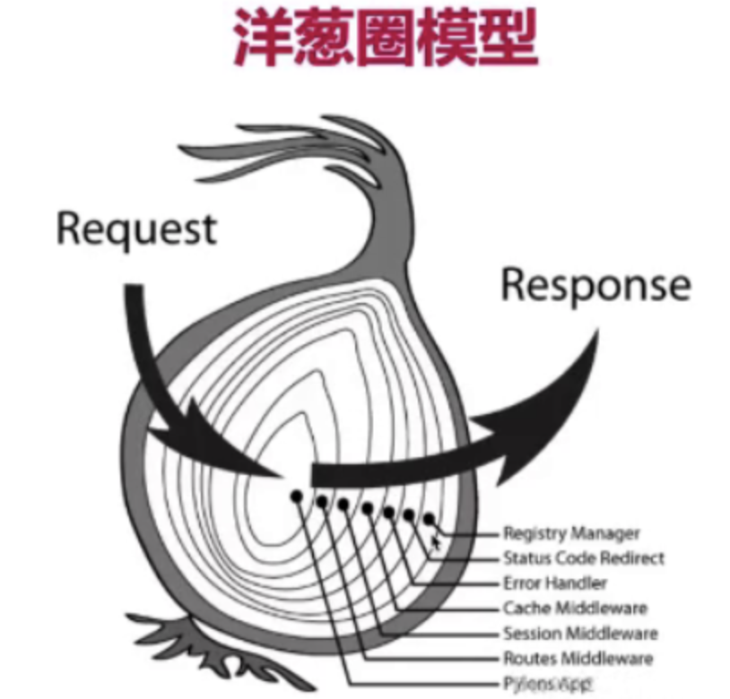
  - app.use用来注册中间件，先收集起来
  - 实现next机制，即上一个通过next触发下一个
  - (不涉及method和path的判断，和express的app实例方法不一样 本身没有路由功能)
- 代码演示见下节

### koa2中间件原理代码演示

> 见lib/koa2文件夹代码演示

### -总结

- 使用async/await的好处
- koa2的使用 以及如何操作session redis日志
- koa2中间件使用和原理

#### 下一步问题

- 目前一直处于开发环境，和前端联调过，但从未上线
- 如何实现线上服务稳定性？PM2是什么
- nginx在线上环境还扮演了重要的作用

## 上线与配置

- 线上环境
  - 服务器稳定性
  - 充分利用服务器硬件资源，以便提高性能(开发环境中的nodemon肯定是做不到的)
  - 线上日志记录(可以通过线上日志排查错误信息以及需要日常记录的信息)
    - 包括自定义日志，错误日志，access log访问日志(通过morgan去生成线上的访问日志即可)
    - (因为开发环境中自定义和错误consolelogerror都是打印在控制台中的，线上的话就需要把他们打出来写在文件中保存下来这就是线上日志记录)
- 上面的问题都可以由PM2工具来解决
  - 进程守护，系统崩溃自动重启
  - 启动多进程，充分利用CPU和内存
  - 自带日志记录功能
- 本章目录
  - PM2介绍
  - PM2进程守护
  - PM2配置和日志记录
  - PM2多进程
  - 关于服务器运维

### 开始和PM2介绍

> 具体见pm2-test文件夹

#### PM2介绍

pm2它是一个线上环境下用于启动nodejs的进程守护的一个工具

- 下载安装`npm install pm2 -g`
  - `pm2 --version`查看pm2的版本
- 基本使用
  - 在本节项目中启动dev的时候还是属于本地nodemon启动，线上时新增npm scripts prd命令 用pm2命令启动appjs服务文件
  - 启动后会发现当前终端不占用进程，终端还能接着用，会列出一个进程表
- 常用命令

### 常用命令

- pm2 start ...(启动某个服务或配置文件), pm2 list(列出所守护进程列表)
- pm2 restart [App name]或[id]名 (这是手动重启的命令)
- pm2 stop [App name]或[id]名 (停止后还可以再启动起来)
- pm2 delete [App name]或[id]名 (删除后就没了启动不了了)
- pm2 info [App name]或[id]名 (看它的基本信息)
- pm2 log [App name]或[id]名 (看当前的日志打印)
- pm2 monit [App name]或[id]名 (可以监控手动看到这个进程的cpu和内存信息)

### 进程守护

- 进程守护是pm2实现服务器稳定性的一个套路
- node app.js 和 nodemon app.js , 进程崩溃则不能访问
- 而pm2 遇到进程崩溃，会自动重启
  - 这是pm2的核心价值之一，遇到错误自动重启，如访问/error路由时程序会报错这时页面会崩溃，这时它自动会执行restart重启命令，你再执行正确的路由就会正确返回结果的，进程信息中restart次数会多一次

### 常用配置

- 新建PM2配置文件(包括进程数量，日志文件目录名称等)
- 修改PM2启动命令，重启
- 访问server，检查日志文件的内容(日志记录是否生效)
- 配置文件就是项目下新建pm2.conf.json文件
  - 配置文件的watch属性是修改文件自动重启，开发环境下需要改为true，线上环境下就不一定了
  - ignore_watch属性：是有哪些文件不需要监听呢
  - error_file属性是错误日志console.error打印的放在哪个路径文件下
  - out_file是console.log打印出的文件存放目录--- 如果不配置这个的话，会默认生成放到默认的文件路径中
  - log_date_format是配置在每条日志上都自动加个时间戳，就不用每次consolelog时自己打印时间戳了
  - 然后在packaagejson里npm scripts里prd启动命令时，改成pm2 start pm2.conf.json配置文件了，这样配置文件就生效了
- 然后在项目下新建logs文件夹下建err.log和out.log两个空文件

### 多进程

- 多进程能充分利用服务器的cpu和内存资源
- 为何使用多进程
  - 因为单个进程的内存毕竟是受限的，操作系统会限制一个进程的最大可用内存，nodejs若用一个进程的话就无法充分利用机器全部内存，也无法充分利用多核cpu的优势，(多核cpu擅长同时处理多个进程，4核cpu就是擅长同时处理4个进程)
- 多进程的问题和redis
  - 但多进程会带来的问题是多个进程之间内存资源是无法共享的，基于session的例子就共享redis的方式来解决
  - 多进程访问一个redis，实现数据共享
  - 接下来在pm2配置文件中配置下多进程
    - 加instances属性为4，电脑是4核的值，nginx配置也是写成4核
    - 然后4个进程启动后，对应的日志文件也是都各自变成4个了，我们每次访问的时候他是有个负载均衡的计算规则的，它会看你当前哪个进程空闲，就把你当前请求派发到对应的进程里，这是pm2本身支持的负载均衡的规则

### 关于运维

- 运维呢更靠近服务器那边，是由专门的运维人员来解决的不应该是我们来解决的
- 服务器运维，一般都由专业的OP人员和部门来处理
  - 服务器的内存监控，硬盘是不是满了，cpu是不是报警了，这些不是咱们的核心价值
- 大公司都有自己的运维团队，中小型公司都推荐使用一些云服务，如阿里云的node平台

#### -总结-

- PM2的核心价值(进程守护，多进程的启动以及线上日志的记录等作用)
- PM2的常用命令和配置，日志记录
- 为什么要多进程，多进程的问题和解决方式
